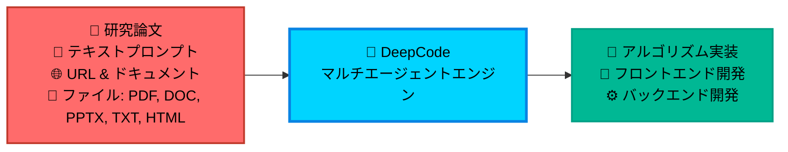

<div align="center">

<table style="border: none; margin: 0 auto; padding: 0; border-collapse: collapse;">
<tr>
<td align="center" style="vertical-align: middle; padding: 10px; border: none; width: 250px;">
  
</td>
<td align="left" style="vertical-align: middle; padding: 10px 0 10px 30px; border: none;">
  <pre style="font-family: 'Courier New', monospace; font-size: 16px; color: #0EA5E9; margin: 0; padding: 0; text-shadow: 0 0 10px #0EA5E9, 0 0 20px rgba(14,165,233,0.5); line-height: 1.2; transform: skew(-1deg, 0deg); display: block;">    ██████╗ ███████╗███████╗██████╗  ██████╗ ██████╗ ██████╗ ███████╗
    ██╔══██╗██╔════╝██╔════╝██╔══██╗██╔════╝██╔═══██╗██╔══██╗██╔════╝
    ██║  ██║█████╗  █████╗  ██████╔╝██║     ██║   ██║██║  ██║█████╗
    ██║  ██║██╔══╝  ██╔══╝  ██╔═══╝ ██║     ██║   ██║██║  ██║██╔══╝
    ██████╔╝███████╗███████╗██║     ╚██████╗╚██████╔╝██████╔╝███████╗
    ╚═════╝ ╚══════╝╚══════╝╚═╝      ╚═════╝ ╚═════╝ ╚═════╝ ╚══════╝</pre>
</td>
</tr>
</table>

<div align="center">
<a href="https://trendshift.io/repositories/14665" target="_blank"></a>
</div>

<!--  -->

#  DeepCode: オープン・エージェンティック・コーディング

### *マルチエージェントシステムによるコード生成の進化*

<!-- <p align="center">
  

  
  
  
</p> -->
<p>
  <a href="https://github.com/HKUDS/DeepCode/stargazers"></a>
  <a href='https://arxiv.org/abs/2512.07921'></a> 
  
  <!-- <a href="https://pypi.org/project/deepcode-hku/"></a> -->
</p>
<p>
  <a href="https://discord.gg/yF2MmDJyGJ"></a>
  <a href="https://github.com/HKUDS/DeepCode/issues/11"></a>
</p>
<div align="center">
  <div style="width: 100%; height: 2px; margin: 20px 0; background: linear-gradient(90deg, transparent, #00d9ff, transparent);"></div>
</div>

<div align="center">
  <a href="#-クイックスタート" style="text-decoration: none;">
    
  </a>
</div>

<div align="center" style="margin-top: 10px;">
  <a href="README.md">
    
  </a>
  <a href="README_ZH.md">
    
  </a>
</div>

### 🖥️ **インターフェース紹介**

<table align="center" width="100%" style="border: none; border-collapse: collapse; margin: 30px 0;">
<tr>
<td width="50%" align="center" style="vertical-align: top; padding: 20px;">

#### 🖥️ **CLI インターフェース**
**ターミナルベースの開発環境**

<div align="center">

  

  <div style="background: linear-gradient(135deg, #2D3748 0%, #4A5568 100%); border-radius: 12px; padding: 15px; margin: 15px 0; color: white;">
    <strong>🚀 高機能ターミナル体験</strong><br/>
    <small>⚡ 高速なコマンドラインワークフロー<br/>🔧 開発者向けのインターフェース<br/>📊 リアルタイムの進捗追跡</small>
  </div>

  *上級ユーザーおよびCI/CD統合向けのプロフェッショナルなターミナルインターフェース*
</div>

</td>
<td width="50%" align="center" style="vertical-align: top; padding: 20px;">

#### 🌐 **Web インターフェース**
**視覚的・対話的な体験**

<div align="center">

  

  <div style="background: linear-gradient(135deg, #0EA5E9 0%, #00D4FF 100%); border-radius: 12px; padding: 15px; margin: 15px 0; color: white;">
    <strong>🎨 モダンなWebダッシュボード</strong><br/>
    <small>🖱️ 直感的なドラッグ＆ドロップ<br/>📱 レスポンシブデザイン<br/>🎯 視覚的な進捗管理</small>
  </div>

  *洗練されたワークフローを提供する美しいWebインターフェース*
</div>

</td>
</tr>
</table>

---

<div align="center">

### 🎬 **紹介ビデオ**

<div style="margin: 20px 0;">
  <a href="https://youtu.be/PRgmP8pOI08" target="_blank">
    
  </a>
</div>

*🎯 **完全版紹介ビデオを見る** - DeepCodeがどのように研究論文や自然言語を本番環境対応のコードに変換するかをご覧ください*

<p>
  <a href="https://youtu.be/PRgmP8pOI08" target="_blank">
    
  </a>
</p>

</div>

---


> *"AIエージェントがアイデアを本番環境対応のコードに変える場所"*

</div>

---

## 📑 目次

- [📰 ニュース](#-ニュース)
- [🚀 主な機能](#-主な機能)
- [🏗️ アーキテクチャ](#-アーキテクチャ)
- [📊 実験結果](#-実験結果)
- [🚀 クイックスタート](#-クイックスタート)
- [💡 使用例](#-使用例)
  - [🎬 ライブデモ](#-ライブデモ)
- [⭐ スター履歴](#-スター履歴)
- [📄 ライセンス](#-ライセンス)


---

## 📰 ニュース

🎉 **[2025-10-28] DeepCodeがPaperBenchでSOTA（最高性能）を達成！**

DeepCodeは、OpenAIのPaperBench Code-Devにおいて全カテゴリで新たなベンチマークを確立しました：

- 🏆 **人間の専門家を超越**: **75.9%** (DeepCode) vs トップクラスの機械学習PhD 72.4% (+3.5%).
- 🥇 **SOTA商用コードエージェントを凌駕**: **84.8%** (DeepCode) vs 主要な商用コードエージェント (+26.1%) (Cursor, Claude Code, Codex).
- 🔬 **科学的コーディングの進歩**: **73.5%** (DeepCode) vs PaperCoder 51.1% (+22.4%).
- 🚀 **LLMエージェントに勝利**: **73.5%** (DeepCode) vs 最良のLLMフレームワーク 43.3% (+30.2%).

---

## 🚀 主な機能

<br/>

<table align="center" width="100%" style="border: none; table-layout: fixed;">
<tr>
<td width="30%" align="center" style="vertical-align: top; padding: 20px;">

<div style="height: 80px; display: flex; align-items: center; justify-content: center;">
<h3 style="margin: 0; padding: 0;">🚀 <strong>Paper2Code</strong></h3>
</div>

<div align="center" style="margin: 15px 0;">
  
</div>

<div style="height: 80px; display: flex; align-items: center; justify-content: center;">
<p align="center"><strong>複雑なアルゴリズムの自動実装</strong></p>
</div>

<div style="height: 60px; display: flex; align-items: center; justify-content: center;">
<p align="center">研究論文の複雑なアルゴリズムを容易に変換し、<strong>高品質</strong>かつ<strong>本番環境対応</strong>のコードとしてアルゴリズム再現を加速させます。</p>
</div>


</td>
<td width="30%" align="center" style="vertical-align: top; padding: 20px;">

<div style="height: 80px; display: flex; align-items: center; justify-content: center;">
<h3 style="margin: 0; padding: 0;">🎨 <strong>Text2Web</strong></h3>
</div>

<div align="center" style="margin: 15px 0;">
  
</div>

<div style="height: 80px; display: flex; align-items: center; justify-content: center;">
<p align="center"><strong>フロントエンドWeb開発の自動化</strong></p>
</div>

<div style="height: 60px; display: flex; align-items: center; justify-content: center;">
<p align="center">平易なテキスト記述を、迅速なインターフェース作成のために<strong>完全に機能する</strong>、<strong>視覚的に魅力的な</strong>フロントエンドWebコードに変換します。</p>
</div>


</td>
<td width="30%" align="center" style="vertical-align: top; padding: 20px;">

<div style="height: 80px; display: flex; align-items: center; justify-content: center;">
<h3 style="margin: 0; padding: 0;">⚙️ <strong>Text2Backend</strong></h3>
</div>

<div align="center" style="margin: 15px 0;">
  
</div>

<div style="height: 80px; display: flex; align-items: center; justify-content: center;">
<p align="center"><strong>バックエンド開発の自動化</strong></p>
</div>

<div style="height: 60px; display: flex; align-items: center; justify-content: center;">
<p align="center">単純なテキスト入力から、<strong>効率的</strong>で<strong>スケーラブル</strong>かつ<strong>機能豊富</strong>なバックエンドコードを生成し、サーバーサイド開発を効率化します。</p>
</div>


</td>
</tr>
</table>

<br/>

---

## 📊 実験結果

<div align="center">
    <br>
</div>
<br/>

私たちは、OpenAIによってリリースされた厳格なテストベッドである[*PaperBench*](https://openai.com/index/paperbench/)ベンチマークを用いて**DeepCode**を評価しました。これは、AIエージェントに20本のICML 2024論文をゼロから独自に再現することを要求するものです。このベンチマークは、階層的な重み付けを用いたSimpleJudgeによって評価される8,316の評価可能コンポーネントで構成されています。

実験では、DeepCodeを4つのベースラインカテゴリと比較しました：**(1) 人間の専門家**、**(2) 最先端の商用コードエージェント**、**(3) 科学的コードエージェント**、**(4) LLMベースのエージェント**。

### ① 🧠 人間の専門家のパフォーマンス (トップクラスの機械学習PhD)

**DeepCode: 75.9% vs. トップクラスの機械学習PhD: 72.4% (+3.5%)**

DeepCodeは、3本の論文による人間評価サブセットにおいて**75.9%**を達成し、**3名の人間専門家ベースラインのベストスコア (72.4%) を3.5ポイント上回りました**。これは、私たちのフレームワークが専門家レベルのコード再現能力に匹敵するだけでなく、それを超えていることを示しており、自律的な科学ソフトウェアエンジニアリングにおける重要なマイルストーンを表しています。

### ② 💼 最先端の商用コードエージェント

**DeepCode: 84.8% vs. 最良の商用エージェント: 58.7% (+26.1%)**

5本の論文サブセットにおいて、DeepCodeは主要な商用コーディングツールを大幅に上回りました：
- Cursor: 58.4%
- Claude Code: 58.7%
- Codex: 40.0%
- **DeepCode: 84.8%**

これは、主要な商用コードエージェントと比較して**+26.1%の改善**を意味します。全ての商用エージェントはClaude Sonnet 4.5またはGPT-5 Codex-highを使用しており、ベースモデルの能力ではなく、**DeepCodeの優れたアーキテクチャ**がこの性能差を生み出していることを強調しています。

### ③ 🔬 科学的コードエージェント

**DeepCode: 73.5% vs. PaperCoder: 51.1% (+22.4%)**

最先端の科学的コード再現フレームワークであるPaperCoder (**51.1%**) と比較して、DeepCodeは**73.5%**を達成し、**+22.4%の相対的な改善**を示しました。この大幅な差は、単純なパイプラインベースのアプローチに対する、計画、階層的タスク分解、コード生成、反復的デバッグを組み合わせた私たちのマルチモジュールアーキテクチャの有効性を実証しています。

### ④ 🤖 LLMベースのエージェント

**DeepCode: 73.5% vs. 最良のLLMエージェント: 43.3% (+30.2%)**

DeepCodeは、テストされた全てのLLMエージェントを大幅に上回りました：
- Claude 3.5 Sonnet + IterativeAgent: 27.5%
- o1 + IterativeAgent (36時間): 42.4%
- o1 BasicAgent: 43.3%
- **DeepCode: 73.5%**

最良のパフォーマンスを持つLLMエージェントに対する**+30.2%の改善**は、複雑なコード再現タスクにおいては、推論時間の延長やモデルの大規模化よりも、洗練されたエージェントの足場（scaffolding）が重要であることを示しています。

---

### 🎯 **自律的・自己調整型マルチエージェントアーキテクチャ**

**課題**:

- 📄 **実装の複雑さ**: 学術論文や複雑なアルゴリズムを動作するコードに変換するには、多大な技術的努力とドメイン知識が必要です。

- 🔬 **研究のボトルネック**: 研究者は、本来の研究や発見活動に集中する代わりに、アルゴリズムの実装に貴重な時間を費やしています。

- ⏱️ **開発の遅延**: 製品チームは、コンセプトからテスト可能なプロトタイプまでの長い待ち時間を経験し、イノベーションサイクルが遅くなります。

- 🔄 **反復的なコーディング**: 開発者は、既存のソリューションを活用する代わりに、類似のパターンや機能を繰り返し実装しています。

**DeepCode**は、一般的な開発タスクに信頼性の高い自動化を提供することでこれらのワークフローの非効率性に対処し、コンセプトからコードまでの開発ワークフローを合理化します。

<div align="center">



</div>

---

## 🏗️ アーキテクチャ

### 📊 **システム概要**

**DeepCode**は、コード生成と実装タスクを自動化するAI駆動の開発プラットフォームです。私たちのマルチエージェントシステムは、要件を機能的でよく構成されたコードに変換するという複雑さを処理し、実装の詳細ではなくイノベーションに集中できるようにします。

🎯 **技術的機能**:

🧬 **リサーチ・トゥ・プロダクション（研究から本番へ）パイプライン**<br>
学術論文からアルゴリズムの論理と数学モデルを抽出するマルチモーダルドキュメント分析エンジン。計算複雑性の特性を維持しながら、適切なデータ構造を備えた最適化された実装を生成します。

🪄 **自然言語コード合成**<br>
厳選されたコードリポジトリでファインチューニングされた言語モデルを使用した、文脈認識型のコード生成。複数のプログラミング言語やフレームワークをサポートしながら、モジュール間のアーキテクチャの一貫性を維持します。

⚡ **自動プロトタイピングエンジン**<br>
データベーススキーマ、APIエンドポイント、フロントエンドコンポーネントを含む完全なアプリケーション構造を生成するインテリジェントな足場（scaffolding）システム。依存関係分析を使用し、初期生成段階からスケーラブルなアーキテクチャを保証します。

💎 **品質保証の自動化**<br>
自動ユニットテスト生成とドキュメント合成を統合した静的分析。AST分析によるコードの正確性と、包括的なカバレッジのためのプロパティベースのテストを採用しています。

🔮 **CodeRAG 統合システム**<br>
意味ベクトル埋め込みとグラフベースの依存関係分析を組み合わせた高度な検索拡張生成（RAG）。大規模なコードコーパスから最適なライブラリと実装パターンを自動的に発見します。

---

### 🔧 **コア技術**

- 🧠 **インテリジェントオーケストレーションエージェント**: ワークフローのフェーズを調整し、要件を分析する中央意思決定システム。進化するプロジェクトの複雑さに基づいて実行戦略をリアルタイムで適応させる動的計画アルゴリズムを採用しています。各実装ステップに最適な処理戦略を動的に選択します。<br>

- 💾 **効率的なメモリメカニズム**: 大規模なコードコンテキストを効率的に管理する高度なコンテキストエンジニアリングシステム。複雑なコードベースを処理するためのインテリジェントな圧縮を備えた階層的メモリ構造を実装しています。このコンポーネントは、実装パターンの即時検索を可能にし、長期間の開発セッション全体で意味的一貫性を維持します。<br>

- 🔍 **高度な CodeRAG システム**: リポジトリ間の複雑な相互依存関係を分析するグローバルコード理解エンジン。包括的な視点からアーキテクチャパターンを理解するために、コードベース間の関係マッピングを実行します。このモジュールは、依存関係グラフと意味分析を活用して、実装中にグローバルに認識されたコード推奨を提供します。

---

### 🤖 **DeepCodeのマルチエージェントアーキテクチャ**:

- **🎯 中央オーケストレーションエージェント**: ワークフロー全体の実行を指揮し、戦略的な決定を下します。入力の複雑さ分析に基づいて専門エージェントを調整します。動的なタスク計画とリソース割り当てアルゴリズムを実装しています。<br>

- **📝 意図理解エージェント**: ユーザー要件の詳細な意味分析を行い、複雑な意図を解読します。高度なNLP処理を通じて機能仕様と技術的制約を抽出します。曖昧な人間の記述を、構造化されたタスク分解を伴う正確で実行可能な開発仕様に変換します。<br>

- **📄 ドキュメント解析エージェント**: 高度な解析機能で複雑な技術文書や研究論文を処理します。ドキュメント理解モデルを使用してアルゴリズムと方法論を抽出します。インテリジェントなコンテンツ分析を通じて、学術的な概念を実用的な実装仕様に変換します。<br>

- **🏗️ コード計画エージェント**: アーキテクチャ設計と技術スタックの最適化を実行します。適応型開発ロードマップのための動的計画を行います。コーディング標準を強制し、自動化されたデザインパターン選択を通じてモジュール構造を生成します。<br>

- **🔍 コード参照マイニングエージェント**: インテリジェントな検索アルゴリズムを通じて関連するリポジトリとフレームワークを発見します。互換性と統合の可能性についてコードベースを分析します。類似性メトリックと自動化された依存関係分析に基づいて推奨事項を提供します。<br>

- **📚 コードインデックス作成エージェント**: 発見されたコードベースの包括的な知識グラフを構築します。コードコンポーネント間の意味的関係を維持します。インテリジェントな検索と相互参照機能を可能にします。<br>

- **🧬 コード生成エージェント**: 収集された情報を実行可能なコード実装に合成します。機能的なインターフェースを作成し、発見されたコンポーネントを統合します。再現性のために包括的なテストスイートとドキュメントを生成します。

---

#### 🛠️ **実装ツールマトリックス**

**🔧 Powered by MCP (Model Context Protocol)**

DeepCodeは、**Model Context Protocol (MCP)**標準を活用して、さまざまなツールやサービスとシームレスに統合します。この標準化されたアプローチは、AIエージェントと外部システム間の信頼性の高い通信を保証し、強力な自動化機能を可能にします。

##### 📡 **MCP サーバー & ツール**

| 🛠️ **MCP サーバー** | 🔧 **主な機能** | 💡 **目的と機能** |
|-------------------|-------------------------|-------------------------------|
| **🔍 brave** | Web検索エンジン | Brave Search APIを介したリアルタイムの情報検索 |
| **🌐 bocha-mcp** | 代替検索 | 独立したAPIアクセスを持つ第2の検索オプション |
| **📂 filesystem** | ファイルシステム操作 | ローカルファイルとディレクトリの管理、読み書き操作 |
| **🌐 fetch** | Webコンテンツ取得 | URLやWebリソースからのコンテンツ取得と抽出 |
| **📥 github-downloader** | リポジトリ管理 | 分析のためのGitHubリポジトリのクローンとダウンロード |
| **📋 file-downloader** | ドキュメント処理 | ファイル（PDF, DOCXなど）のダウンロードとMarkdownへの変換 |
| **⚡ command-executor** | システムコマンド | 環境管理のためのbash/shellコマンドの実行 |
| **🧬 code-implementation** | コード生成ハブ | 実行とテストを伴う包括的なコード再現 |
| **📚 code-reference-indexer** | スマートコード検索 | コードリポジトリのインテリジェントなインデックス作成と検索 |
| **📄 document-segmentation** | スマートドキュメント分析 | 大規模な論文や技術文書のためのインテリジェントなドキュメント分割 |

##### 🔧 **レガシーツール機能** *(参考)*

| 🛠️ **機能** | 🎯 **使用コンテキスト** |
|-----------------|---------------------|
| **📄 read_code_mem** | メモリからの効率的なコードコンテキスト検索 |
| **✍️ write_file** | 直接的なファイルコンテンツの生成と修正 |
| **🐍 execute_python** | Pythonコードのテストと検証 |
| **📁 get_file_structure** | プロジェクト構造の分析と整理 |
| **⚙️ set_workspace** | 動的なワークスペースと環境の設定 |
| **📊 get_operation_history** | プロセス監視と操作追跡 |


---

🎛️ **マルチインターフェースフレームワーク**<br>
リアルタイムコードストリーミング、インタラクティブデバッグ、CI/CD統合のための拡張可能なプラグインアーキテクチャを備えたCLIおよびWebフロントエンドを持つRESTful API。

**🚀 マルチエージェントインテリジェントパイプライン:**

<div align="center">

### 🌟 **インテリジェンス処理フロー**

<table align="center" width="100%" style="border: none; border-collapse: collapse;">
<tr>
<td colspan="3" align="center" style="padding: 20px; background: linear-gradient(135deg, #667eea 0%, #764ba2 100%); border-radius: 15px; color: white; font-weight: bold;">
💡 <strong>入力レイヤー</strong><br/>
📄 研究論文 • 💬 自然言語 • 🌐 URL • 📋 要件
</td>
</tr>
<tr><td colspan="3" height="20"></td></tr>
<tr>
<td colspan="3" align="center" style="padding: 15px; background: linear-gradient(135deg, #ff6b6b 0%, #ee5a24 100%); border-radius: 12px; color: white; font-weight: bold;">
🎯 <strong>中央オーケストレーション</strong><br/>
戦略的意思決定 • ワークフロー調整 • エージェント管理
</td>
</tr>
<tr><td colspan="3" height="15"></td></tr>
<tr>
<td align="center" style="padding: 12px; background: linear-gradient(135deg, #3742fa 0%, #2f3542 100%); border-radius: 10px; color: white; width: 50%;">
📝 <strong>テキスト分析</strong><br/>
<small>要件処理</small>
</td>
<td width="10"></td>
<td align="center" style="padding: 12px; background: linear-gradient(135deg, #8c7ae6 0%, #9c88ff 100%); border-radius: 10px; color: white; width: 50%;">
📄 <strong>ドキュメント分析</strong><br/>
<small>論文 & 仕様書処理</small>
</td>
</tr>
<tr><td colspan="3" height="15"></td></tr>
<tr>
<td colspan="3" align="center" style="padding: 15px; background: linear-gradient(135deg, #00d2d3 0%, #54a0ff 100%); border-radius: 12px; color: white; font-weight: bold;">
📋 <strong>再現計画</strong><br/>
詳細な論文分析 • コード要件解析 • 再現戦略策定
</td>
</tr>
<tr><td colspan="3" height="15"></td></tr>
<tr>
<td align="center" style="padding: 12px; background: linear-gradient(135deg, #ffa726 0%, #ff7043 100%); border-radius: 10px; color: white; width: 50%;">
🔍 <strong>参照分析</strong><br/>
<small>リポジトリ発見</small>
</td>
<td width="10"></td>
<td align="center" style="padding: 12px; background: linear-gradient(135deg, #e056fd 0%, #f368e0 100%); border-radius: 10px; color: white; width: 50%;">
📚 <strong>コードインデックス作成</strong><br/>
<small>知識グラフ構築</small>
</td>
</tr>
<tr><td colspan="3" height="15"></td></tr>
<tr>
<td colspan="3" align="center" style="padding: 15px; background: linear-gradient(135deg, #26de81 0%, #20bf6b 100%); border-radius: 12px; color: white; font-weight: bold;">
🧬 <strong>コード実装</strong><br/>
実装生成 • テスト • ドキュメント化
</td>
</tr>
<tr><td colspan="3" height="15"></td></tr>
<tr>
<td colspan="3" align="center" style="padding: 20px; background: linear-gradient(135deg, #045de9 0%, #09c6f9 100%); border-radius: 15px; color: white; font-weight: bold;">
⚡ <strong>成果物提供</strong><br/>
📦 完全なコードベース • 🧪 テストスイート • 📚 ドキュメント • 🚀 デプロイ準備完了
</td>
</tr>
</table>

</div>

<div align="center">
<br/>

### 🔄 **プロセスインテリジェンス機能**

<table align="center" style="border: none;">
<tr>
<td align="center" width="25%" style="padding: 15px;">
<div style="background: #f8f9fa; border-radius: 10px; padding: 15px; border-left: 4px solid #ff6b6b;">
<h4>🎯 適応型フロー</h4>
<p><small>入力の複雑さに基づく動的なエージェント選択</small></p>
</div>
</td>
<td align="center" width="25%" style="padding: 15px;">
<div style="background: #f8f9fa; border-radius: 10px; padding: 15px; border-left: 4px solid #4ecdc4;">
<h4>🧠 スマートコーディネーション</h4>
<p><small>インテリジェントなタスク分散と並列処理</small></p>
</div>
</td>
<td align="center" width="25%" style="padding: 15px;">
<div style="background: #f8f9fa; border-radius: 10px; padding: 15px; border-left: 4px solid #45b7d1;">
<h4>🔍 コンテキスト認識</h4>
<p><small>CodeRAG統合による深い理解</small></p>
</div>
</td>
<td align="center" width="25%" style="padding: 15px;">
<div style="background: #f8f9fa; border-radius: 10px; padding: 15px; border-left: 4px solid #96ceb4;">
<h4>⚡ 品質保証</h4>
<p><small>全体を通した自動テストと検証</small></p>
</div>
</td>
</tr>
</table>

</div>

---


## 🚀 クイックスタート


### 📦 **ステップ 1: インストール**

#### ⚡ **直接インストール (推奨)**

```bash
# 🚀 DeepCodeパッケージを直接インストール
pip install deepcode-hku

# 🔑 設定ファイルをダウンロード
curl -O https://raw.githubusercontent.com/HKUDS/DeepCode/main/mcp_agent.config.yaml
curl -O https://raw.githubusercontent.com/HKUDS/DeepCode/main/mcp_agent.secrets.yaml

# 🔑 APIキーの設定 (必須)
# mcp_agent.secrets.yaml を編集してAPIキーとbase_urlを設定してください:
# - openai: api_key, base_url (OpenAI/カスタムエンドポイント用)
# - anthropic: api_key (Claudeモデル用)
# - google: api_key (Geminiモデル用)

# 🤖 優先LLMプロバイダーの選択 (オプション)
# mcp_agent.config.yaml を編集してLLMを選択 (106行目付近):
# - llm_provider: "google"    # Google Geminiモデルを使用
# - llm_provider: "anthropic" # Anthropic Claudeモデルを使用
# - llm_provider: "openai"    # OpenAI/互換モデルを使用
# 注意: 設定がない場合や利用不可の場合は、自動的に利用可能な最初のプロバイダーにフォールバックします

# 🔑 Web検索用APIキーの設定 (オプション)
# mcp_agent.config.yaml を編集してAPIキーを設定:
# - Brave Search用: brave.env セクションで BRAVE_API_KEY: "your_key_here" を設定 (28行目付近)
# - Bocha-MCP用: bocha-mcp.env セクションで BOCHA_API_KEY: "your_key_here" を設定 (74行目付近)

# 📄 ドキュメント分割の設定 (オプション)
# mcp_agent.config.yaml を編集してドキュメント処理を制御:
# - enabled: true/false (インテリジェントドキュメント分割を使用するかどうか)
# - size_threshold_chars: 50000 (分割をトリガーするドキュメントサイズ閾値)
```

#### 🔧 **開発用インストール (ソースから)**

<details>
<summary><strong>📂 開発用インストールオプションを展開するにはクリック</strong></summary>

##### 🔥 **UVの使用 (開発に推奨)**

```bash
# 🔽 リポジトリをクローン
git clone https://github.com/HKUDS/DeepCode.git
cd DeepCode/

# 📦 UVパッケージマネージャーをインストール
curl -LsSf https://astral.sh/uv/install.sh | sh

# 🔧 UVで依存関係をインストール
uv venv --python=3.13
source .venv/bin/activate  # Windowsの場合: .venv\Scripts\activate
uv pip install -r requirements.txt

# 🔑 APIキーの設定 (必須)
# mcp_agent.secrets.yaml を編集してAPIキーとbase_urlを設定:
# - openai: api_key, base_url (OpenAI/カスタムエンドポイント用)
# - anthropic: api_key (Claudeモデル用)
# - google: api_key (Geminiモデル用)

# 🤖 優先LLMプロバイダーの選択 (オプション)
# mcp_agent.config.yaml を編集してLLMを選択 (106行目付近):
# - llm_provider: "google"    # Google Geminiモデルを使用
# - llm_provider: "anthropic" # Anthropic Claudeモデルを使用
# - llm_provider: "openai"    # OpenAI/互換モデルを使用
# 注意: 設定がない場合や利用不可の場合は、自動的に利用可能な最初のプロバイダーにフォールバックします

# 🔑 Web検索用APIキーの設定 (オプション)
# mcp_agent.config.yaml を編集してAPIキーを設定:
# - Brave Search用: brave.env セクションで BRAVE_API_KEY: "your_key_here" を設定 (28行目付近)
# - Bocha-MCP用: bocha-mcp.env セクションで BOCHA_API_KEY: "your_key_here" を設定 (74行目付近)

# 📄 ドキュメント分割の設定 (オプション)
# mcp_agent.config.yaml を編集してドキュメント処理を制御:
# - enabled: true/false (インテリジェントドキュメント分割を使用するかどうか)
# - size_threshold_chars: 50000 (分割をトリガーするドキュメントサイズ閾値)
```

##### 🐍 **従来のpipの使用**

```bash
# 🔽 リポジトリをクローン
git clone https://github.com/HKUDS/DeepCode.git
cd DeepCode/

# 📦 依存関係をインストール
pip install -r requirements.txt

# 🔑 APIキーの設定 (必須)
# mcp_agent.secrets.yaml を編集してAPIキーとbase_urlを設定:
# - openai: api_key, base_url (OpenAI/カスタムエンドポイント用)
# - anthropic: api_key (Claudeモデル用)
# - google: api_key (Geminiモデル用)

# 🤖 優先LLMプロバイダーの選択 (オプション)
# mcp_agent.config.yaml を編集してLLMを選択 (106行目付近):
# - llm_provider: "google"    # Google Geminiモデルを使用
# - llm_provider: "anthropic" # Anthropic Claudeモデルを使用
# - llm_provider: "openai"    # OpenAI/互換モデルを使用
# 注意: 設定がない場合や利用不可の場合は、自動的に利用可能な最初のプロバイダーにフォールバックします

# 🔑 Web検索用APIキーの設定 (オプション)
# mcp_agent.config.yaml を編集してAPIキーを設定:
# - Brave Search用: brave.env セクションで BRAVE_API_KEY: "your_key_here" を設定 (28行目付近)
# - Bocha-MCP用: bocha-mcp.env セクションで BOCHA_API_KEY: "your_key_here" を設定 (74行目付近)

# 📄 ドキュメント分割の設定 (オプション)
# mcp_agent.config.yaml を編集してドキュメント処理を制御:
# - enabled: true/false (インテリジェントドキュメント分割を使用するかどうか)
# - size_threshold_chars: 50000 (分割をトリガーするドキュメントサイズ閾値)
```

</details>

#### 🪟 **Windowsユーザー: 追加のMCPサーバー設定**

Windowsを使用している場合、`mcp_agent.config.yaml` でMCPサーバーを手動設定する必要があるかもしれません:

```bash
# 1. MCPサーバーをグローバルにインストール
npm i -g @modelcontextprotocol/server-brave-search
npm i -g @modelcontextprotocol/server-filesystem

# 2. グローバルなnode_modulesパスを確認
npm -g root
```

次に、`mcp_agent.config.yaml` を絶対パスを使用するように更新します:

```yaml
mcp:
  servers:
    brave:
      command: "node"
      args: ["C:/Program Files/nodejs/node_modules/@modelcontextprotocol/server-brave-search/dist/index.js"]
    filesystem:
      command: "node"
      args: ["C:/Program Files/nodejs/node_modules/@modelcontextprotocol/server-filesystem/dist/index.js", "."]
```

> **注意**: パスをステップ2で確認した実際のグローバルnode_modulesパスに置き換えてください。

#### 🔍 **検索サーバー設定 (オプション)**

DeepCodeは、Web検索機能のために複数の検索サーバーをサポートしています。`mcp_agent.config.yaml` で好みのオプションを設定できます:

```yaml
# デフォルト検索サーバー設定
# オプション: "brave" または "bocha-mcp"
default_search_server: "brave"
```

**利用可能なオプション:**
- **🔍 Brave Search** (`"brave"`):
  - 高品質な検索結果を提供するデフォルトオプション
  - BRAVE_API_KEYの設定が必要
  - ほとんどのユーザーに推奨

- **🌐 Bocha-MCP** (`"bocha-mcp"`):
  - 代替の検索サーバーオプション
  - BOCHA_API_KEYの設定が必要
  - ローカルPythonサーバー実装を使用

**mcp_agent.config.yaml でのAPIキー設定:**
```yaml
# For Brave Search (default) - around line 28
brave:
  command: "npx"
  args: ["-y", "@modelcontextprotocol/server-brave-search"]
  env:
    BRAVE_API_KEY: "your_brave_api_key_here"

# For Bocha-MCP (alternative) - around line 74
bocha-mcp:
  command: "python"
  args: ["tools/bocha_search_server.py"]
  env:
    PYTHONPATH: "."
    BOCHA_API_KEY: "your_bocha_api_key_here"
```

> **💡 ヒント**: 両方の検索サーバーともAPIキーの設定が必要です。APIアクセスと要件に最も適したものを選択してください。

### ⚡ **ステップ 2: アプリケーションの起動**

#### 🚀 **インストール済みパッケージの使用 (推奨)**

```bash
# 🌐 Webインターフェースを直接起動
deepcode

# アプリケーションは自動的に http://localhost:8501 で起動します
```

#### 🛠️ **ソースコードの使用**

好みのインターフェースを選択してください:

##### 🌐 **Web インターフェース** (推奨)
```bash
# UVの使用
uv run streamlit run ui/streamlit_app.py
# または従来のPythonの使用
streamlit run ui/streamlit_app.py
```
<div align="center">
  
</div>

##### 🖥️ **CLI インターフェース** (上級ユーザー向け)
```bash
# UVの使用
uv run python cli/main_cli.py
# または従来のPythonの使用
python cli/main_cli.py
```
<div align="center">
  
</div>

### 🎯 **ステップ 3: コード生成**

1. **📄 入力**: 研究論文のアップロード、要件の提供、またはURLのペースト
2. **🤖 処理**: マルチエージェントシステムによる分析と計画の監視
3. **⚡ 出力**: テストとドキュメントを含む本番環境対応コードの受け取り


  ---

## 💡 使用例


### 🎬 **ライブデモ**


<table align="center">
<tr>
<td width="33%" align="center">

#### 📄 **Paper2Code デモ**
**研究から実装へ**

<div align="center">
  <a href="https://www.youtube.com/watch?v=MQZYpLkzsbw">
    
  </a>

  **[▶️ デモを見る](https://www.youtube.com/watch?v=MQZYpLkzsbw)**

  *学術論文を本番環境対応コードに自動変換*
</div>

</td>
<td width="33%" align="center">

#### 🖼️ **画像処理デモ**
**AI駆動の画像ツール**

<div align="center">
  <a href="https://www.youtube.com/watch?v=nFt5mLaMEac">
    
  </a>

  **[▶️ デモを見る](https://www.youtube.com/watch?v=nFt5mLaMEac)**

  *背景除去と強調機能を備えたインテリジェント画像処理*
</div>

</td>
<td width="33%" align="center">

#### 🌐 **フロントエンド実装**
**完全なWebアプリケーション**

<div align="center">
  <a href="https://www.youtube.com/watch?v=78wx3dkTaAU">
    
  </a>

  **[▶️ デモを見る](https://www.youtube.com/watch?v=78wx3dkTaAU)**

  *コンセプトからデプロイまでのフルスタックWeb開発*
</div>

</td>
</tr>
</table>


### 🆕 **最近の更新**

#### 📄 **スマートドキュメント分割 (v1.2.0)**
- **インテリジェント処理**: LLMのトークン制限を超える大規模な研究論文や技術文書を自動的に処理
- **設定可能な制御**: サイズベースの閾値による分割の設定切り替え
- **意味解析**: アルゴリズム、概念、数式の保存を伴う高度なコンテンツ理解
- **後方互換性**: 小規模なドキュメントの場合は従来の処理にシームレスにフォールバック

### 🚀 **近日公開**

DeepCodeをさらに強化する新機能を継続的に開発しています：

#### 🔧 **コード信頼性と検証の強化**
- **自動テスト**: 実行検証とエラー検出を伴う包括的な機能テスト。
- **コード品質保証**: 静的分析、動的テスト、パフォーマンスベンチマークによる多層検証。
- **スマートデバッグ**: 自動修正提案を伴うAI駆動のエラー検出。

#### 📊 **PaperBench パフォーマンスショーケース**
- **ベンチマークダッシュボード**: PaperBench評価スイート上の包括的なパフォーマンスメトリクス。
- **精度メトリクス**: 最先端の論文再現システムとの詳細な比較。
- **成功分析**: 論文カテゴリと複雑さレベルにまたがる統計分析。

#### ⚡ **システム全体の最適化**
- **パフォーマンス向上**: 生成を高速化するためのマルチスレッド処理と最適化されたエージェント調整。
- **推論強化**: コンテキスト理解を向上させた高度な推論機能。
- **サポート拡大**: 追加のプログラミング言語とフレームワークへの互換性拡張。

---

## ⭐ スター履歴

<div align="center">

*コミュニティの成長軌跡*

<a href="https://star-history.com/#HKUDS/DeepCode&Date">
  <picture>
    <source media="(prefers-color-scheme: dark)" srcset="https://api.star-history.com/svg?repos=HKUDS/DeepCode&type=Date&theme=dark" />
    <source media="(prefers-color-scheme: light)" srcset="https://api.star-history.com/svg?repos=HKUDS/DeepCode&type=Date" />
    
  </picture>
</a>

</div>

---

### 🚀 **開発を変革する準備はできましたか？**

<div align="center">

<p>
  <a href="#-クイックスタート"></a>
  <a href="https://github.com/HKUDS"></a>
  <a href="https://github.com/HKUDS/deepcode-agent"></a>
</p>

---

<div align="left">
  
### 📖 **引用**


DeepCodeがあなたの研究やアプリケーションに役立った場合は、以下の引用をお願いします：

```
@misc{li2025deepcodeopenagenticcoding,
      title={DeepCode: Open Agentic Coding}, 
      author={Zongwei Li and Zhonghang Li and Zirui Guo and Xubin Ren and Chao Huang},
      year={2025},
      eprint={2512.07921},
      archivePrefix={arXiv},
      primaryClass={cs.SE},
      url={https://arxiv.org/abs/2512.07921}, 
}
```

---


### 📄 **ライセンス**

<div align="center">


**MIT License** - Copyright (c) 2025 Data Intelligence Lab, The University of Hong Kong

---


</div>
